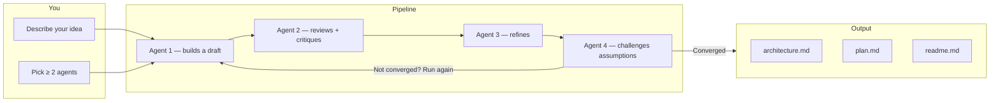

# A2A Brainstorm

> Turn a raw product idea into structured architecture documents through a controlled multi-agent pipeline.

[](LICENSE)

**A2A Brainstorm** is a local design workspace — not a chatbot. You describe a product idea, pick a team of specialized AI agents (architect, critic, refiner, devil's advocate), and let them iterate on a shared design state until it converges. At the end, you export reviewable Markdown artifacts: `architecture.md`, `plan.md`, and `readme.md`.

The golden rule: agents pass a **canonical state** through a fixed-role pipeline. Same input + same config = identical output. No free-form chat, no randomness between runs.

---

## How it works



Each full pass through all agents is one **iteration**. After each pass the engine checks whether the design has stabilised (confidence score). When it has — or when you hit the max-iteration limit — you finalise the session and download your documents.

---

## Scenarios

**1. You have a product idea and need architecture + planning documents**

Open the UI, type your idea, select agents, and hit **Start Session**. Run iterations until the confidence bar turns green, then click **Finalize Session** and generate your documents.

```sh
make start
# Open http://localhost:5173
```

**2. You want multiple agents to challenge and refine your design**

Agents have fixed roles — builder, reviewer, refiner, devil's advocate. During the session you can see exactly what each agent contributed to the canonical state after every pass.

Each agent shows a summary like:

> *"Contributed a 6-step execution plan, 8 risks, 15 assumptions, and 15 open questions."*

**3. You want to inject your own feedback mid-session**

Between iterations, use **Inject Feedback** to add notes, constraints, or corrections that get folded into the canonical state before the next pass starts.

**4. You need a quick clarification step before agents start**

The session wizard includes an optional **Clarify your idea** screen. Answer guided questions about who the users are, what must work at launch, and what the non-negotiables are. Skip any you don't need.

**5. You want to guide the tech stack — or let agents decide**

On the session creation form, expand **Tech Constraints** to pin must-use technologies (e.g. Go, PostgreSQL, Docker) or flip the toggle to **Let agents decide** and let the pipeline propose and validate the stack itself.

**6. You want to use a different LLM provider**

Agents default to DeepSeek. Switch to Anthropic Claude or GitHub Copilot by editing `.env`. No code changes needed — provider and credentials are config only.

```env
GLOBAL_LLM_PROVIDER=claude
GLOBAL_LLM_MODEL=claude-sonnet-4-5
GLOBAL_LLM_CREDENTIAL_REF=CLAUDE_API_KEY
CLAUDE_API_KEY=sk-ant-...
```

---

## Installation

### What you need

| Tool                  | Version              |
| --------------------- | -------------------- |
| Docker + Docker Compose | latest             |
| GNU Make              | 3.81+                |
| Go                    | 1.26+ (local dev only) |
| Node.js               | 20+ (local dev only) |
| pnpm                  | 9+ (local dev only)  |

### Docker (recommended — one command)

```sh
cp .env.example .env
# Open .env and set at least one API key:
#   DEEPSEEK_API_KEY  or  CLAUDE_API_KEY  or  COPILOT_API_KEY
make start
```

That's it. Docker Compose starts PostgreSQL, the backend, the agent binary, and the SvelteKit frontend, then runs all database migrations.

| Service       | URL                                                |
| ------------- | -------------------------------------------------- |
| Frontend UI   | http://localhost:5173                              |
| Backend API   | http://localhost:8080                              |
| Agent card    | http://localhost:9090/.well-known/agent-card.json  |

---

## Quick Start

```sh
# 1. Clone and configure
git clone https://github.com/okfriansyah-moh/a2a-brainstorm
cd a2a-brainstorm
cp .env.example .env
# Set at least one API key in .env

# 2. Start everything
make start

# 3. Open the UI
open http://localhost:5173
```

Then in the browser:

1. Go to **Settings** → **Agents** and create at least 2 agents with different roles (`build`, `review`, `refine`, `devils advocate`)
2. Go back to the home page and fill in your product idea
3. Select your agents in the **Agent Pool**
4. Optionally answer the clarifying questions and set tech constraints
5. Click **Start Session**
6. Click **Run Next Iteration** until the confidence reaches 90%+
7. Click **Finalize Session** → select documents → **Generate Documents**
8. Copy or download the generated Markdown

---

## LLM Providers

| Provider         | Config value | Credential env var   |
| ---------------- | ------------ | -------------------- |
| DeepSeek         | `deepseek`   | `DEEPSEEK_API_KEY`   |
| Anthropic Claude | `claude`     | `CLAUDE_API_KEY`     |
| GitHub Copilot   | `copilot`    | `COPILOT_API_KEY`    |
| OpenCode proxy   | `opencode`   | (OAuth via OpenCode) |

Set the provider in `.env`:

```env
GLOBAL_LLM_PROVIDER=deepseek
GLOBAL_LLM_MODEL=deepseek-v4-flash
GLOBAL_LLM_CREDENTIAL_REF=DEEPSEEK_API_KEY
DEEPSEEK_API_KEY=your-key-here
```

> **Security:** API keys are never stored in the database or config files. The `*_CREDENTIAL_REF` variables hold only the **name** of the env var, not the key itself. A missing key makes that agent unavailable — no silent fallback.

### GitHub Copilot via OpenCode (OAuth)

If you prefer not to use a plain API key, OpenCode provides a Copilot OAuth flow:

```sh
make opencode-up
make opencode-auth    # opens browser for one-time GitHub OAuth
make opencode-status  # confirm it's healthy
```

Then set `AGENT_LLM_PROVIDER=opencode` in `.env`.

---

## Commands

All Docker operations go through the Makefile — do not run `docker compose` directly.

| Command              | Description                                           |
| -------------------- | ----------------------------------------------------- |
| `make start`         | Rebuild images, start all services, apply migrations  |
| `make start-fast`    | Start services + migrations (no rebuild)              |
| `make docker-down`   | Stop and remove containers                            |
| `make docker-logs`   | Tail logs from all services                           |
| `make docker-scale`  | Scale agent service (default `SCALE=2`)               |
| `make migrate`       | Apply SQL migrations from `migrations/`               |
| `make test`          | Run backend + agent Go tests                          |
| `make lint`          | `go vet` + frontend type check                        |
| `make check`         | Full build + vet + frontend build                     |
| `make frontend`      | Start SvelteKit dev server (local dev)                |
| `make opencode-up`   | Start OpenCode container (Copilot OAuth)              |
| `make opencode-auth` | One-time GitHub Copilot OAuth flow                    |
| `make opencode-down` | Stop OpenCode container                               |

---

## Architecture

```text
Frontend (SvelteKit)
    |  HTTP + SSE
    v
Backend (Go — modular monolith)
  session · iteration · agent · state · convergence · markdown
    |              |
    v              v
PostgreSQL 16    Agent binary (Go — A2A executor)
                    |
                    v
              LLM Provider (DeepSeek / Claude / Copilot)
```

The backend runs a **sequential pipeline**: each agent receives the full canonical state, appends its contribution, and passes it to the next agent. After every full pass, a convergence engine scores the delta. Pipeline progress streams to the frontend over **Server-Sent Events** (no WebSocket, no polling).

### Repository layout

```text
a2a-brainstorm/
  backend/               Go modular monolith (REST API + pipeline engine)
  agent/                 A2A executor binary (one instance per agent slot)
  frontend/              SvelteKit workspace UI
  migrations/            Append-only SQL files (001–005+)
  docs/                  Architecture blueprint + implementation plan
  docker-compose.yml     postgres, backend, agent, frontend, opencode
  Makefile               All Docker and quality-gate commands
  .env.example           Copy to .env and fill in API keys
```

### Frontend pages

| Route              | What you do there                                         |
| ------------------ | --------------------------------------------------------- |
| `/`                | Create a new session (idea + agents + constraints)        |
| `/session/:id`     | Watch the pipeline run, inject feedback, finalise         |
| `/settings`        | Manage agents, skills, and roles                          |
| `/history`         | Browse past sessions and their generated documents        |

---

## Contributing

Before changing behaviour, read:

- `docs/A2A-agent-Brainstorm.md` — architecture source of truth (read-only after design lock)
- `docs/PLAN.md` — implementation tasks and deep reference (§8 read-only during execution)
- `AGENTS.md` — agent and skill governance

Rules:
- Migrations are **append-only** — never modify existing files in `migrations/`
- Every change must pass the full quality gate: `make test` → `make lint` → `make check`
- No direct SQL in module code — use `repository.go` files only
- No direct LLM SDK calls in modules — use the `LLMProvider` interface only

For detailed local dev setup, see [docs/STARTUP_GUIDE.md](docs/STARTUP_GUIDE.md).
