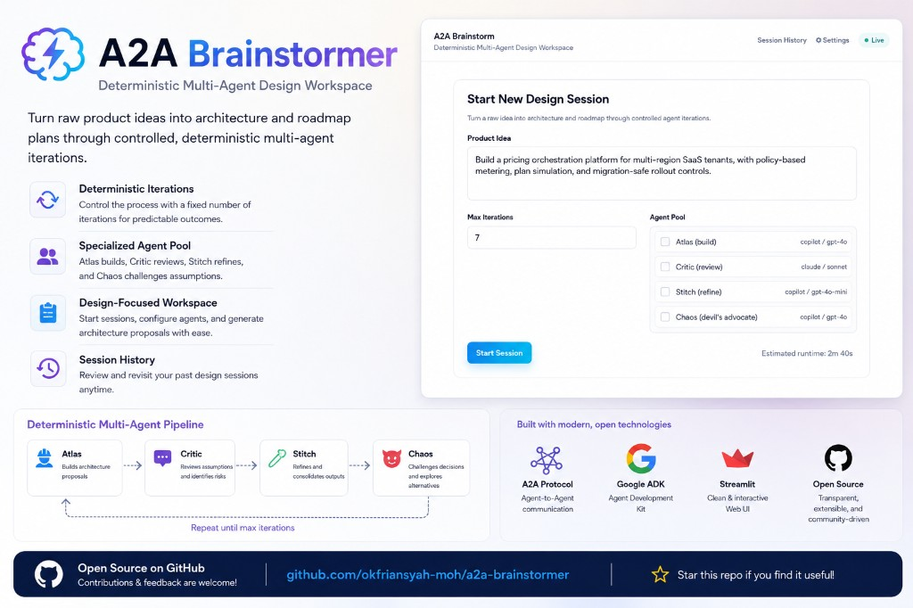
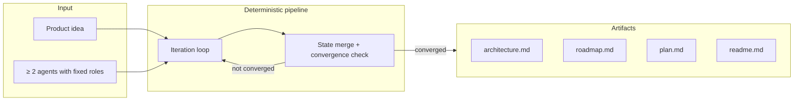
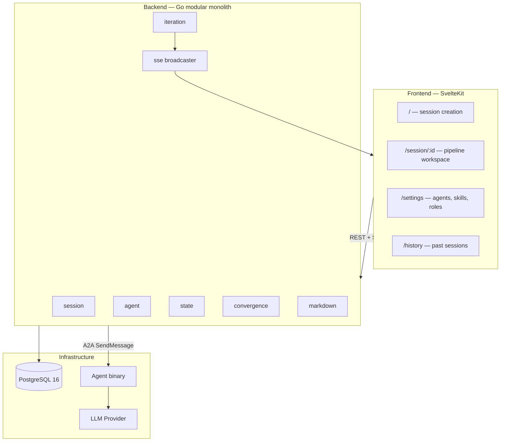

# a2a-brainstorm

a2a-brainstorm is a deterministic multi-agent design IDE — not a chatbot.



Input an idea, run an ordered pipeline of LLM-backed agents, detect convergence, and emit reviewable engineering artifacts (`architecture.md`, `roadmap.md`, `plan.md`, `readme.md`).

The golden rule: same input + same config = identical output. Agents pass structured canonical state through a fixed-role pipeline until convergence — never free-form chat.

## When to use a2a-brainstorm

Use it when you need **structured design artifacts** produced by multiple specialized agents with distinct roles — not a single LLM conversation.



### Scenarios

**1. You have a product idea and need architecture + roadmap documents**

Create a session with at least two agents, run iterations until convergence, then finalize to download Markdown artifacts.

```sh
make start
# Register agents via UI at http://localhost:5173/settings
# Create session → Run pipeline → Finalize
```

**2. You want multiple agents to challenge and refine a design**

Each agent has a fixed role (builder, reviewer, refiner, devil's advocate). Roles are assigned at session creation and do not alternate at runtime.

```sh
curl -X POST http://localhost:8080/sessions \
  -H "Content-Type: application/json" \
  -d '{
    "idea": "A real-time collaborative document editor with conflict resolution",
    "agent_ids": ["<agent-1-id>", "<agent-2-id>"],
    "max_iterations": 5
  }'
```

**3. Your team uses different LLM providers**

Configure per-agent or global LLM settings. Supported providers: GitHub Copilot, Claude, and OpenCode (Copilot OAuth proxy). Credentials are env-var references only — never stored in source or the database.

```env
GLOBAL_LLM_PROVIDER=copilot
GLOBAL_LLM_MODEL=gpt-4o
GLOBAL_LLM_CREDENTIAL_REF=COPILOT_API_KEY
COPILOT_API_KEY=sk-...
```

**4. You want to preview one agent's output before applying it**

Run a single agent against the current state, inspect the preview, then apply or discard.

```sh
curl -X POST http://localhost:8080/sessions/<id>/preview/<agent-id>
curl http://localhost:8080/sessions/<id>/preview/<agent-id>
curl -X POST http://localhost:8080/sessions/<id>/preview/<agent-id>/apply
```

**5. You need real-time pipeline progress in the UI**

Subscribe to Server-Sent Events while the iteration engine runs. No WebSocket, no polling.

```sh
curl -N http://localhost:8080/sessions/<id>/events
```

**6. You want to scale agent capacity**

Run multiple agent containers and point the backend at all endpoints.

```sh
make docker-scale SCALE=3
# Update AGENT_ENDPOINTS in .env with all agent URLs
```

## Installation

### Prerequisites

| Tool                    | Version                  |
| ----------------------- | ------------------------ |
| Docker + Docker Compose | latest                   |
| GNU Make                | 3.81+                    |
| Go                      | 1.26+ (local dev only)   |
| Node.js                 | 20+ (local dev only)     |
| pnpm                    | 9+ (local dev only)      |
| PostgreSQL              | 16 (provided via Docker) |
| `psql` CLI              | any (used by `make migrate`) |

Quick checks:

```sh
make --version
docker compose version
node --version
pnpm --version
psql --version
```

### Docker (recommended)

One command starts postgres, backend, agent, frontend, and applies migrations:

```sh
cp .env.example .env
# Edit .env — set at least one API key (COPILOT_API_KEY or CLAUDE_API_KEY)
make start
```

Endpoints after startup:

| Service      | URL                                              |
| ------------ | ------------------------------------------------ |
| Frontend UI  | http://localhost:5173                            |
| Backend API  | http://localhost:8080                            |
| Agent A2A card | http://localhost:9090/.well-known/agent-card.json |

### Local development (without Docker for Go/frontend)

Start infrastructure only, then run services locally:

```sh
docker compose up -d postgres
make migrate
make build && make build-agent
make frontend   # SvelteKit dev server
# Run backend and agent binaries separately — see docs/STARTUP_GUIDE.md
```

### OpenCode (optional — GitHub Copilot OAuth)

OpenCode is a separate opt-in container for Copilot OAuth (no plain API key). See [docs/STARTUP_GUIDE.md §9](docs/STARTUP_GUIDE.md) for the full walkthrough.

```sh
make opencode-up
make opencode-auth    # one-time browser OAuth
make opencode-status  # confirm health
```

## Quick Start

```sh
cp .env.example .env
# Set COPILOT_API_KEY or CLAUDE_API_KEY in .env

make start

# Open http://localhost:5173
# 1. Register ≥ 2 agents under /settings
# 2. Create a session with your idea
# 3. Run iterations until convergence
# 4. Finalize and download artifacts
```

Quality gate before committing changes:

```sh
make test
make lint
make check
```

## Command Reference

All Docker operations use Makefile targets — do not run `docker compose` directly.

| Command                     | Description                                              |
| --------------------------- | -------------------------------------------------------- |
| `make start`                | Start all services + apply migrations                    |
| `make docker-up`            | Start all services in the background                     |
| `make docker-down`          | Stop and remove containers                               |
| `make docker-restart`       | Stop then start all services                             |
| `make docker-ps`            | List running containers                                  |
| `make docker-scale`         | Scale agent service (default `SCALE=2`)                  |
| `make docker-logs`          | Tail logs from all services                              |
| `make migrate`              | Apply all SQL migrations from `migrations/`              |
| `make build`                | Build backend binary                                     |
| `make build-agent`          | Build agent binary                                       |
| `make test`                 | Run backend + agent Go tests                             |
| `make lint`                 | `go vet` (backend + agent) + frontend `pnpm check`       |
| `make check`                | Full build + vet + frontend check/build                  |
| `make frontend`             | Start frontend dev server                                |
| `make frontend-build`       | Build frontend production bundle                         |
| `make opencode-up`          | Start OpenCode container (Copilot OAuth)                 |
| `make opencode-auth`        | One-time GitHub Copilot OAuth flow                       |
| `make opencode-status`      | Print OpenCode health JSON                               |
| `make opencode-down`        | Stop OpenCode container (auth volume preserved)          |

Scale example:

```sh
make docker-scale SCALE=3
```

## Provider Support

| Provider       | Config value | Credential env var  | Notes                              |
| -------------- | ------------ | ------------------- | ---------------------------------- |
| GitHub Copilot | `copilot`    | `COPILOT_API_KEY`   | Direct API key or via OpenCode OAuth |
| Anthropic Claude | `claude`   | `CLAUDE_API_KEY`    | Direct API key                     |
| OpenCode proxy | `opencode`   | (OAuth via OpenCode) | Requires `make opencode-up` + auth |

| Variable                    | Scope   | Required | Description                                      |
| --------------------------- | ------- | -------- | ------------------------------------------------ |
| `GLOBAL_LLM_PROVIDER`       | Backend | ✅       | Default LLM provider                             |
| `GLOBAL_LLM_MODEL`          | Backend | ✅       | Default model name                               |
| `GLOBAL_LLM_CREDENTIAL_REF` | Backend | ✅       | Env var **name** holding the API key             |
| `AGENT_LLM_PROVIDER`        | Agent   | ❌       | Per-agent provider override                      |
| `AGENT_LLM_CREDENTIAL_REF`  | Agent   | ❌       | Env var name for agent's API key                 |
| `AGENT_ENDPOINTS`           | Backend | ✅       | Comma-separated agent base URLs                  |
| `VITE_API_BASE_URL`         | Frontend | ❌      | Backend URL (default: `http://localhost:8080`)   |

> **Security rule:** API keys are never stored in source code, config files, or the database. `*_CREDENTIAL_REF` variables hold the env var name only; keys are resolved at runtime. Missing credentials → agent unavailable (no silent fallback).

## Architecture

```text
frontend/ (SvelteKit)
       |
       | HTTP + SSE
       v
backend/ (Go 1.26 modular monolith)
  session · iteration · agent · state · convergence · markdown
       |
       +--- pgx/v5 ---> PostgreSQL 16
       |
       +--- A2A (a2a-go/v2) ---> agent/ (Go BrainstormExecutor)
                                      |
                                      v
                               LLMProvider (Copilot / Claude / OpenCode)
```



a2a-brainstorm is a **local design workspace** — a modular monolith with A2A agent dispatch. It is not a chat application, not an autonomous agent swarm, and not a provider-agnostic AI runtime framework.

## Repository Format

```text
a2a-brainstorm/
  backend/                  Go modular monolith (REST API + orchestration)
    cmd/server/             Backend entry point
    internal/modules/       Vertical slices: session, iteration, agent, state, ...
    internal/platform/      Config, DB, LLM, SSE, A2A client
  agent/                    A2A executor binary (BrainstormExecutor)
    cmd/server/             Agent entry point
    internal/executor/      A2A message handler
    internal/llm/           Copilot, OpenCode provider implementations
  frontend/                 SvelteKit structured workspace (not chat UI)
    src/routes/             Pages: /, /session/:id, /settings, /history
    src/lib/components/     PipelineStage, CanonicalStatePanel, RiskBoard, ...
  migrations/               Append-only SQL migrations (001–005+)
  docs/
    A2A-agent-Brainstorm.md Architecture blueprint (source of truth)
    PLAN.md                   Implementation task plan
    STARTUP_GUIDE.md          Beginner-friendly local setup
  .github/
    agents/                   Agent definitions (task-runner, Explore)
    skills/                   Pre-digested knowledge packages
    copilot-instructions.md   Copilot global rules
  AGENTS.md                   Agent & skill governance
  docker-compose.yml          postgres, backend, agent, frontend, opencode
  Makefile                    All Docker and quality-gate commands
```

### Frontend routes

| Route                   | Purpose                                            |
| ----------------------- | -------------------------------------------------- |
| `/`                     | Home — new session creation form                   |
| `/session/:id`          | Session workspace — sequential agent pipeline view |
| `/session/:id/finalize` | Export view — generation log + download artifacts  |
| `/settings`             | Unified settings — Agents, Skills, Roles tabs      |
| `/settings/agent/new`   | Create new agent                                   |
| `/settings/agent/:id`   | Edit existing agent                                |
| `/settings/skill/new`   | Create new skill                                   |
| `/settings/skill/:id`   | Edit existing skill                                |
| `/history`              | Session history — stats + past sessions table      |
| `/agents`               | Redirects to `/settings?tab=agents`                |
| `/skills`               | Redirects to `/settings?tab=skills`                |

### API workflow

```sh
# Register at least 2 agents (via UI or API)
curl -X POST http://localhost:8080/agents -H "Content-Type: application/json" -d '{...}'

# Create a session
curl -X POST http://localhost:8080/sessions -H "Content-Type: application/json" -d '{...}'

# Run an iteration
curl -X POST http://localhost:8080/sessions/<session-id>/iterate

# Get current state
curl http://localhost:8080/sessions/<session-id>

# Finalize and export artifacts
curl -X POST http://localhost:8080/sessions/<session-id>/finalize
```

## Contributing

Read [docs/A2A-agent-Brainstorm.md](docs/A2A-agent-Brainstorm.md), [docs/PLAN.md](docs/PLAN.md), and [AGENTS.md](AGENTS.md) before changing behavior.

- Architecture invariants and API contracts live in `docs/A2A-agent-Brainstorm.md` (read-only after design lock).
- Implementation tasks and deep knowledge reference live in `docs/PLAN.md`.
- Agent and skill governance lives in `AGENTS.md` and `.github/skills/`.
- Migrations are append-only — never modify existing files in `migrations/`.
- Every change must pass the full quality gate: `make test` → `make lint` → `make check`.

See [docs/STARTUP_GUIDE.md](docs/STARTUP_GUIDE.md) for detailed local development setup.
