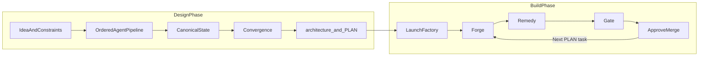
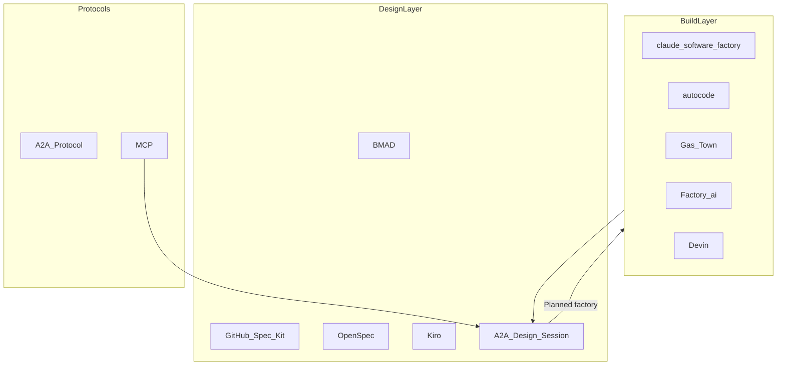
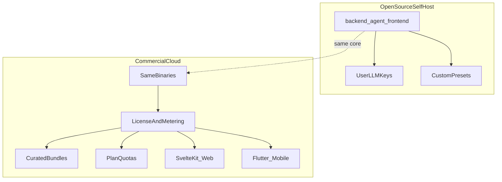
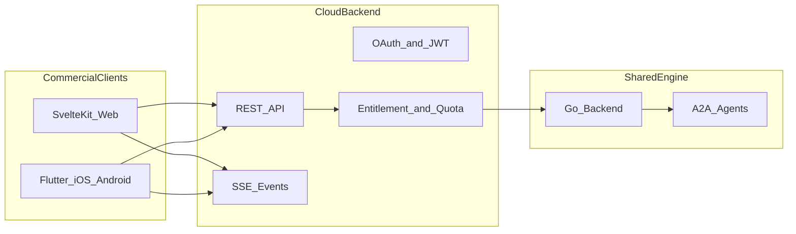

# A2A Software Factory — Vision, Competitive Landscape & Open-Core Strategy

**Date:** 2026-06-16 (updated 2026-06-16 — commercial mobile)  
**Status:** Draft (living strategy document)  
**Visual SSOT:** [frontend/mockups/v4.html](../frontend/mockups/v4.html) (web); commercial mobile **Planned** (Flutter, no mockup yet)

---

## Purpose

This document consolidates product strategy, competitive positioning, and open-core commercialization decisions for the **A2A Software Factory** — the full vision described in [frontend/mockups/v4.html](../frontend/mockups/v4.html) (Design → Build → Ship, with attachments and MCP from [frontend/mockups/v3.html](../frontend/mockups/v3.html)).

Use it to:

- Resume work after breaks without re-deriving context from chat history
- Align engineering, UX, and go-to-market on what to build vs what to ignore
- Separate **open-source self-host** from **commercial managed cloud** before implementation diverges

**Related canonical docs (do not duplicate):**

| Document                                                | Role                                            |
| ------------------------------------------------------- | ----------------------------------------------- |
| [docs/A2A-agent-Brainstorm.md](A2A-agent-Brainstorm.md) | Architecture SSOT (read-only after design lock) |
| [docs/PLAN.md](PLAN.md)                                 | Implementation tasks and schemas                |
| [frontend/mockups/v4.html](../frontend/mockups/v4.html) | Full product UX mockup (future plan SSOT)       |
| [frontend/mockups/v3.html](../frontend/mockups/v3.html) | Locked attachment + MCP UX                      |
| [docs/STARTUP_GUIDE.md](STARTUP_GUIDE.md)               | Local deployment                                |

**Implementation status legend used in this doc:**

| Label        | Meaning                                                  |
| ------------ | -------------------------------------------------------- |
| **Shipped**  | Exists in `backend/`, `agent/`, or `frontend/src/` today |
| **Planned**  | In PLAN.md and/or v4 mockup; not fully implemented       |
| **Strategy** | Product/business direction; no code yet                  |

---

## Table of contents

1. [One-line positioning](#1-one-line-positioning)
2. [Product vision (v4 in one page)](#2-product-vision-v4-in-one-page)
3. [Landscape map](#3-landscape-map)
4. [How v4 differs from the big names](#4-how-v4-differs-from-the-big-names)
5. [Closest comparisons (by layer)](#5-closest-comparisons-by-layer)
6. [What is actually similar to the full v4 vision?](#6-what-is-actually-similar-to-the-full-v4-vision)
7. [Competitive positioning (plain language)](#7-competitive-positioning-plain-language)
8. [Who to watch (and borrow from)](#8-who-to-watch-and-borrow-from)
9. [What you should NOT optimize for](#9-what-you-should-not-optimize-for)
10. [What to focus on (product, codebase, v4.html)](#10-what-to-focus-on-product-codebase-v4html)
11. [Parallelism model](#11-parallelism-model)
12. [The model: open-core + managed cloud](#12-the-model-open-core--managed-cloud)
13. [What maps cleanly to our stack](#13-what-maps-cleanly-to-our-stack)
14. [Recommended open vs commercial split](#14-recommended-open-vs-commercial-split)
15. [How to enforce paywall and quota (technically)](#15-how-to-enforce-paywall-and-quota-technically)
16. [Licensing (important early decision)](#16-licensing-important-early-decision)
17. [Positioning vs Factory.ai / Devin / Gas Town](#17-positioning-vs-factoryai--devin--gas-town)
18. [Codebase focus so OSS + commercial stay one product](#18-codebase-focus-so-oss--commercial-stay-one-product)
19. [Risks to plan for](#19-risks-to-plan-for)
20. [Appendix](#20-appendix)
21. [Commercial mobile — idea and build anywhere (Flutter)](#21-commercial-mobile--idea-and-build-anywhere-flutter)

---

## 1. One-line positioning

> **Copilot and Cursor help you write code. A2A Software Factory helps a team agree on architecture, produce a governed PLAN, then run that plan through PRs until it ships.**

**Mobile (commercial):** Capture an idea on your phone, watch the design pipeline converge, and approve factory merges from anywhere — same cloud account, same sessions and projects.

**Elevator variants:**

- **Open source (self-host):** Run the full design → PLAN → factory pipeline on your infra. Bring your own LLM keys. Customize every agent, skill, and preset.
- **Commercial (cloud):** Same pipeline, zero ops — curated factory bundles, managed GitHub integration, team quotas, and the v4 golden path out of the box. **Optional Flutter apps** (iOS/Android) for on-the-go idea capture and factory approvals.
- **For buyers:** Not another chat IDE — a **controlled software production line** with human merge gates and auditable design state.

---

## 2. Product vision (v4 in one page)

The product has two phases and supports many parallel idea→ship lines.

### Design phase (**Shipped** core; v4 UX **Planned** extensions)

1. User describes an idea (+ optional tech constraints, clarify questions, session-scope attachments).
2. Fixed-order **N-agent pipeline** (min 2): e.g. build → review → refine → devil's advocate.
3. Each pass updates **canonical state** in PostgreSQL (idea, architecture, risks, assumptions, execution plan, etc.).
4. **Convergence engine** decides when to stop iterating (confidence delta, stability rules).
5. User **finalizes** → generates `architecture.md`, `plan.md`, `readme.md` (and related docs per PLAN).
6. Human checkpoints: **Inject Feedback** (text + iteration-scoped attachments), run next iteration, review pipeline stages and risk board.

### Build phase — Software Factory (**Planned** — v4 mockup only today)

1. **Launch Software Factory** from finalized session → GitHub auth → provision repo with design artifacts.
2. Pick **build agents** (Forge, Remedy, Gate presets or custom).
3. For each **PLAN.md task** in order:
   - **Forge** — implement task files, open PR
   - **Remedy** — fix PR review comments (e.g. Copilot review)
   - **Gate** — CI (tests, lint, build)
   - Human **approve merge** → next task auto-starts
4. Factory dashboard: task progress, PR phase, pause/resume.

### v4 screens to preserve as product north star

| v4 area                                         | What it proves                       |
| ----------------------------------------------- | ------------------------------------ |
| Home + idea frame + `+` attachments             | Session-scope context at creation    |
| Clarify + tech constraints                      | Design-before-code, not chat-first   |
| Session pipeline + canonical state + risk board | Structured workspace, not bubbles    |
| Next-iteration panel (feedback + attachments)   | Queue context for upcoming round     |
| Finalize → Launch Factory                       | Design → Build handoff               |
| Projects + History                              | Many sessions, many factory runs     |
| Factory hero dashboard                          | Operational status, not agent logs   |
| Settings MCP + agent MCP picker                 | Tools at dispatch, not on every page |



---

## 3. Landscape map

Tools cluster by **which half of the pipeline** they own. Almost nobody owns the **full** v4 stack.

```text
                    DESIGN (spec / architecture)
                              |
    BMAD --- Spec Kit --- OpenSpec --- Kiro --- A2A brainstorm session
                              |
                    BUILD (code / PR / CI)
                              |
    claude-software-factory --- autocode --- Gas Town --- Factory.ai --- Devin
                              |
                    BOTH HALVES (partial)
                              |
                    forge-ai --- github-agents --- headless-agentic-codebase
```



| Layer         | Examples                                         | Role                                                               |
| ------------- | ------------------------------------------------ | ------------------------------------------------------------------ |
| Design        | BMAD, Spec Kit, OpenSpec, Kiro                   | Spec → plan → tasks before code                                    |
| Build         | claude-software-factory, autocode, github-agents | Issue/PR loops, review-fix-merge                                   |
| Factory scale | Gas Town + Beads, Factory.ai, Devin              | Many agents, many tasks, enterprise SDLC                           |
| Protocols     | A2A, MCP, LangGraph/CrewAI                       | A2A = our agent wire; MCP = tools; LangGraph = library not product |

---

## 4. How v4 differs from the big names

We are **not** trying to beat chat IDEs at inline coding. We are building a **governed two-phase factory**.

| Dimension               | Copilot web / Cursor / Claude web / OpenCode | Devin / Factory.ai            | A2A Software Factory v4                                   |
| ----------------------- | -------------------------------------------- | ----------------------------- | --------------------------------------------------------- |
| Primary UX              | Chat or IDE agent                            | Autonomous engineer / droids  | Structured workspace (pipeline, state, factory dashboard) |
| Unit of work            | Message, file, open-ended task               | Ticket, prompt, migration job | Session pass → PLAN task → PR                             |
| Multi-agent             | Usually one model; optional subagents        | Agent network                 | Fixed roles over **A2A** (separate agent binaries)        |
| Memory / truth          | Thread, repo index, org memory               | Platform memory               | **Canonical state** in Postgres + merge rules             |
| When coding starts      | Immediately                                  | On delegation                 | After **convergence** + **finalize**                      |
| Design debate           | Ad hoc in chat                               | Light spec research           | Multi-agent **convergence** + confidence + risk board     |
| Build loop              | User-driven edits                            | Auto PR / review              | **Forge → Remedy → Gate** per PLAN task + human merge     |
| Relationship to Copilot | Is the product                               | Uses Copilot among engines    | **Engine inside** Forge/Remedy roles                      |
| Parallel ideas          | Per repo / per chat                          | Per workspace                 | **Sessions** + **Projects** with lineage                  |

---

## 5. Closest comparisons (by layer)

### 5.1 Design phase

| Product         | Link                                               | Overlap with us                                              | Gap vs us                                                               |
| --------------- | -------------------------------------------------- | ------------------------------------------------------------ | ----------------------------------------------------------------------- |
| BMAD Method     | https://github.com/bmad-code-org/BMAD-METHOD       | 12+ agent personas; PRD, architecture, stories; agile phases | IDE/chat workflows; no DB canonical state, convergence, or A2A services |
| GitHub Spec Kit | https://github.com/github/spec-kit                 | `specify → plan → tasks → implement`; `tasks.md`             | Per-feature in repo; no multi-agent brainstorm UI                       |
| OpenSpec        | https://github.com/Fission-AI/OpenSpec             | Lighter spec-driven: proposal, design, tasks, apply          | No factory dashboard or session model                                   |
| AWS Kiro        | Spec-driven IDE (see BMAD vs Spec Kit comparisons) | `requirements.md`, `design.md`, `tasks.md` before code       | IDE lock-in; no convergence engine                                      |

**Our design half is closest to BMAD + Spec Kit**, plus **convergence**, **canonical state**, and **non-chat pipeline UI**.

### 5.2 Build phase

| Project                   | Link                                                      | Overlap with us                                | Gap vs us                                                          |
| ------------------------- | --------------------------------------------------------- | ---------------------------------------------- | ------------------------------------------------------------------ |
| claude-software-factory   | https://github.com/greynewell/claude-software-factory     | GitHub Actions: code → review → shepherd merge | **Closest to Forge/Remedy/Gate**; starts at issues, not brainstorm |
| autocode                  | https://github.com/ajsai47/autocode                       | Named agent pipeline; daemon via Actions       | Repo-local; no upstream design system                              |
| github-agents             | https://github.com/Hadar01/github-agents                  | Issue → code → self-review → PR                | Single CLI pipeline                                                |
| headless-agentic-codebase | https://github.com/nkhdiscovery/headless-agentic-codebase | Unattended issue loop, self-merge              | Template for one repo                                              |
| forge-ai                  | https://github.com/Artaeon/forge-ai                       | Plan→code→verify→review→fix                    | Local multi-LLM orchestrator                                       |

**Our factory half is closest to claude-software-factory + autocode**, with an explicit **design phase** and **session → project** lineage.

### 5.3 Factory at scale

| Product          | Link                                                                          | Overlap with us                                            | Gap vs us                                          |
| ---------------- | ----------------------------------------------------------------------------- | ---------------------------------------------------------- | -------------------------------------------------- |
| Gas Town + Beads | https://github.com/gastownhall/gastown · https://github.com/gastownhall/beads | 20–30 parallel agents; git worktrees; merge queue metaphor | Power-user terminal ops; no productized brainstorm |
| Factory.ai       | https://factory.ai/                                                           | SDLC droids; GitHub/Jira/MCP; delegate and review diff     | Black-box SaaS; weak governed design loop          |
| Devin            | https://devin.ai/                                                             | End-to-end tasks; parallel migrations                      | Sandbox chat UX; not multi-agent design debate     |

### 5.4 Protocols

| Protocol           | Link                      | Our usage                                                                   |
| ------------------ | ------------------------- | --------------------------------------------------------------------------- |
| A2A                | https://a2a-protocol.org/ | **Shipped** — `a2a-go/v2`; backend `internal/platform/a2a/`; agent executor |
| MCP                | Model Context Protocol    | **Planned** — PLAN Tasks 47–52; Settings in v4                              |
| LangGraph / CrewAI | Orchestration libraries   | Could build on; we chose custom engine + A2A agents                         |

---

## 6. What is actually similar to the full v4 vision?

**No single incumbent combines all seven:**

1. Multi-agent **design** with convergence, confidence %, and risk board
2. **Canonical state** as SSOT (not only markdown in a repo)
3. Finalize → governed `architecture.md` + **`plan.md`** with per-task Goal / Files / Validation / Invariant check
4. **Launch factory** → GitHub project per idea
5. Sequential **PLAN** execution (Forge / Remedy / Gate) + human merge approval
6. **Sessions + Projects** UI for parallel idea→ship lines
7. **A2A** between role-specialized agent services + multi-provider LLM registry (**Shipped** registry direction per PLAN Tasks 39–41)

**The wedge:** pieces exist everywhere; the **integrated governed pipeline** (design convergence → PLAN contract → factory execution) is still uncommon as one product.

---

## 7. Competitive positioning (plain language)

| They optimize for…               | We optimize for…                                                        |
| -------------------------------- | ----------------------------------------------------------------------- |
| Fast edits in editor or chat     | **Agreed design** before code                                           |
| One repo, one developer flow     | **Many sessions/projects** with clear lineage                           |
| Ad-hoc agent prompts             | **Fixed roles**, merge rules, convergence                               |
| Maximum autonomy ("ship it")     | **Controlled factory** — pause, inject feedback, approve merge          |
| Model quality and context window | **Process quality** — PLAN, invariants, validation gates                |
| Single vendor runtime            | **Provider orchestration** — Copilot, Claude, OpenCode, etc. as engines |

We compete on **workflow and governance**, not on owning the best foundation model.

---

## 8. Who to watch (and borrow from)

| Source                                                                                                     | What to borrow                                                   |
| ---------------------------------------------------------------------------------------------------------- | ---------------------------------------------------------------- |
| [BMAD Method](https://github.com/bmad-code-org/BMAD-METHOD)                                                | Multi-role design workflows; artifact handoffs between phases    |
| [GitHub Spec Kit](https://github.com/github/spec-kit) / [OpenSpec](https://github.com/Fission-AI/OpenSpec) | `plan.md` / `tasks.md` structure; implement-from-plan flow       |
| [claude-software-factory](https://github.com/greynewell/claude-software-factory)                           | PR shepherd; review-fix-merge when CI green                      |
| [Gas Town](https://github.com/gastownhall/gastown) + [Beads](https://github.com/gastownhall/beads)         | Parallel projects; persistent work graph; convoy/merge metaphors |
| [Factory.ai](https://factory.ai/) / [Devin](https://devin.ai/)                                             | Enterprise "delegate work, review diff" UX and positioning       |

**Not direct competitors:** Cursor, Copilot, Claude.ai, OpenCode as chat/IDE surfaces — they are **LLM engines inside our roles** (especially Forge and Remedy), not the factory product itself.

---

## 9. What you should NOT optimize for

Do not chase incumbents on their home turf:

- Best **inline autocomplete** or single-file edit speed
- **Replacing the IDE** (Cursor/Copilot remain where humans edit)
- Winning on **raw model quality** or largest context window
- **Open-ended autonomous agents** that roam the repo without PLAN boundaries
- Another **generic chat UI** with a `+` button as the main experience
- **Fully unattended** ship with no merge approval (conflicts with controlled factory brand)

---

## 10. What to focus on (product, codebase, v4.html)

### Product / mockup priorities

| Focus                         | v4 surface                                          | Codebase anchor                                                           | Status                                               |
| ----------------------------- | --------------------------------------------------- | ------------------------------------------------------------------------- | ---------------------------------------------------- |
| Session → Project handoff     | Finalize → Launch Software Factory                  | `frontend/.../finalize/`; factory views in v4                             | Finalize **Shipped**; factory **Planned**            |
| Canonical state + convergence | Pipeline + sidebar panels                           | `backend/internal/modules/state/`, `convergence/`, `iteration/`           | **Shipped**                                          |
| PLAN as executable contract   | Factory task cards                                  | `docs/PLAN.md` Task 36+; `markdown/generator_plan.go`                     | Generators **Shipped**; factory consumer **Planned** |
| Factory dashboard             | `#factory-view` hero, mini-steps                    | Future `modules/factory/` or similar                                      | **Planned**                                          |
| Human control points          | Inject feedback, pause, approve merge               | `session/[id]/+page.svelte`; v4 factory JS                                | Feedback **Shipped**; factory controls **Planned**   |
| Multi-idea parallelism        | History + Projects tabs                             | `migrations/003_sessions.sql`; per-session lock in `iteration/service.go` | Sessions **Shipped**; projects **Planned**           |
| Attachments + MCP             | Home + next-iteration + Settings                    | PLAN Tasks 44–52; v3/v4 mockups                                           | **Planned**                                          |
| Non-chat workspace            | `PipelineStage`, `CanonicalStatePanel`, `RiskBoard` | `frontend/src/...` session page                                           | **Shipped** (v1.1 UI)                                |

### Engineering priorities (in order of strategic value)

1. **Convergence + state merge** — moat vs markdown-only spec kits (**Shipped**, keep hardening)
2. **PLAN.md quality** — tasks must be executable by factory (enricher, invariants, validation commands)
3. **Preview/apply per agent** — controlled iteration without full pass waste
4. **Factory GitHub integration** — provision repo, PR loop, Remedy on review comments (**Planned**)
5. **Usage events** — foundation for commercial metering (**Planned**)
6. **Attachments + MCP** — table stakes for enterprise context (**Planned**)

**Deprioritize:** chat bubbles, IDE plugins, autocomplete UX.

---

## 11. Parallelism model

Clarifies "many ideas in parallel" vs internal sequencing.

| Scope                                | Parallel?                                   | Mechanism                                              | Status                               |
| ------------------------------------ | ------------------------------------------- | ------------------------------------------------------ | ------------------------------------ |
| Different **sessions** (ideas)       | Yes                                         | Isolated UUID; separate `current_state` JSONB          | **Shipped**                          |
| Different **factory projects**       | Yes (by design)                             | Separate GitHub repos + PLAN queues                    | **Planned**                          |
| One session — two iterations at once | No                                          | Per-session `TryLock`; HTTP 409 `ErrIterationInFlight` | **Shipped** (`iteration/service.go`) |
| One session — agents in one pass     | No                                          | Ordered by `session_agents.position ASC`               | **Shipped**                          |
| One factory project — PLAN tasks     | No (v4)                                     | Sequential tasks; human merge between tasks            | **Planned**                          |
| SSE backpressure                     | ~50 concurrent sessions (architecture note) | Ring buffer sizing in blueprint                        | **Strategy**                         |

**"Start to finish"** means: automated **between** gates, not zero human involvement. Users finalize design, launch factory, and approve merges.

---

## 12. The model: open-core + managed cloud

Same engine, two packaging layers (GitLab / Supabase / Temporal pattern).

|                   | **Open source**                                                   | **Commercial (hosted)**                                               |
| ----------------- | ----------------------------------------------------------------- | --------------------------------------------------------------------- |
| **Audience**      | Teams who self-host and customize                                 | Teams who want the v4 golden path with zero ops                       |
| **Clients**       | SvelteKit web only (self-host)                                    | SvelteKit web **+ Flutter mobile** (iOS/Android, cloud API only)      |
| **Configuration** | Custom agents, roles, skills, MCP, LLM providers, factory presets | **Curated presets** locked or versioned by us                         |
| **UX**            | Full UI; all knobs exposed                                        | Same UI; guided defaults                                              |
| **Limits**        | User pays infra + LLM; no platform quota                          | **Plan quotas** (sessions, iterations, factory tasks, seats, storage) |
| **Support**       | Community                                                         | SLA, onboarding, enterprise features                                  |



---

## 13. What maps cleanly to our stack

| Open source (self-host)                                           | Commercial (you operate)                         |
| ----------------------------------------------------------------- | ------------------------------------------------ |
| `backend/` + `agent/` + `frontend/` modular monolith              | Same container images                            |
| `docker-compose` (see STARTUP_GUIDE)                              | Multi-tenant SaaS or dedicated cells             |
| BYOK via `backend/internal/platform/llm/` + `agent/internal/llm/` | Optional bundled LLM credits + BYOK              |
| Editable agents/skills/roles in Settings                          | Locked **factory bundles**                       |
| No license server                                                 | Control plane + Stripe (or similar)              |
| Example presets in repo                                           | Production presets you maintain                  |
| No mobile app in OSS repo                                         | **Flutter** app(s) in private `commercial/` repo |

Architecture invariant: **one deployable backend**, separate **agent** image per A2A agent — cloud does not fork this model.

---

## 14. Recommended open vs commercial split

### Open source (maximize customization)

- Backend modular monolith, agent binary, SvelteKit UI
- A2A client/server, `BrainstormPayload`, canonical state, merge, convergence
- Iteration engine, finalize, markdown generators
- Attachment + MCP modules (when implemented)
- Multi-provider LLM registry
- Docker Compose / Helm charts
- Example agent/skill/preset YAML — fully editable

### Commercial (paywall + quota)

- Hosted multi-tenant workspaces
- **Pre-defined factory bundles** (design crew + Forge/Remedy/Gate stacks)
- Managed **GitHub OAuth** app and webhook ops
- **Usage metering** and plan enforcement
- Team features: RBAC, audit log, SSO (SAML)
- Premium: priority queue, longer runs, dedicated agents
- Optional: managed MCP connector hosting
- **Flutter mobile apps** (iOS + Android) — commercial-only; see [§21](#21-commercial-mobile--idea-and-build-anywhere-flutter)

**Rule:** Open = **engine + self-host + BYOK + web**. Commercial = **convenience + scale + governance + v4 default highway + mobile anywhere**.

Never cripple the open UI; add a **private commercial layer** instead.

---

## 15. How to enforce paywall and quota (technically)

**Status: Planned** — document for future implementation; no entitlement code in repo yet.

### Configuration

```text
DEPLOYMENT_MODE=selfhosted | cloud
COMMERCIAL_LICENSE_KEY=...   # empty in OSS
```

Add getters in `backend/internal/platform/config/config.go` only (per security invariants).

### Entitlement interface

```text
backend/internal/platform/entitlement/
  provider.go      # interface: Allow(ctx, orgID, action) error
  noop.go          # OSS: always allow
  cloud.go         # commercial: check plan + quota
```

### Middleware hooks (expensive operations)

| Action             | Route (conceptual)                  | Meter unit              |
| ------------------ | ----------------------------------- | ----------------------- |
| Create session     | `POST /sessions`                    | `sessions_created`      |
| Run iteration      | `POST /sessions/{id}/iterate`       | `iterations_run`        |
| Start factory task | `POST /projects/{id}/tasks/{n}/run` | `factory_tasks_started` |
| Upload attachment  | `POST /sessions/{id}/attachments`   | `attachment_bytes`      |

Return **402 Payment Required** or **403 Forbidden** when over quota; OSS skips all checks.

### Usage storage

- Table `usage_events` (append-only) or monthly counters per `org_id`
- Dimensions: `sessions_created`, `iterations_run`, `factory_tasks_merged`, `attachment_bytes`
- Reset on billing period boundary

**Prefer metering iterations and factory tasks** over raw tokens — aligns with buyer mental model.

---

## 16. Licensing (important early decision)

| License                      | Good for                                          | Tradeoff                                    |
| ---------------------------- | ------------------------------------------------- | ------------------------------------------- |
| **Apache 2.0 / MIT**         | Maximum adoption; corporate embedding             | Others can host competing SaaS on your code |
| **AGPL-3.0**                 | Strong copyleft; discourages closed hosted clones | Some enterprises avoid AGPL                 |
| **BSL** (e.g. MariaDB-style) | OSS + delayed commercial use                      | Harder to explain; community friction       |

**Recommended pattern (strategy):**

- **Public repo:** core under **Apache 2.0** or **MIT**
- **Private repo or `commercial/` package:** control plane, billing, license server, cloud-only presets — never published
- Add `LICENSE` file to repo (README already references it)

Decision recorded here when made; do not edit `docs/PLAN.md` §8 for this.

---

## 17. Positioning vs Factory.ai / Devin / Gas Town

### Factory.ai and Devin

Enterprise **autonomous SDLC** platforms. Strong at delegate-work → review-diff, GitHub/Jira integration, long-running tasks. Weak at **multi-agent design convergence** and **PLAN-as-contract** with invariant checks per task.

**Our angle:** They can be **engines inside Forge/Remedy** or comparison points for the build half. We sell the **full highway** from idea to merge, with design governance upstream.

### Gas Town and Beads

**Operator-grade** multi-agent orchestration for power users (20–30 agents, git worktrees, bead graph). Excellent for parallel convoys; not a productized **Design → Build** UI with session/project lineage.

**Our angle:** Productize the factory for teams who will not run `gt` in tmux. Borrow **persistent work units** and **merge-queue** metaphors.

### OSS vs commercial messaging

| Edition         | Message                                                                                                                                              |
| --------------- | ---------------------------------------------------------------------------------------------------------------------------------------------------- |
| **Open source** | Self-host the design → PLAN → factory pipeline; bring your models; customize everything.                                                             |
| **Commercial**  | Same pipeline, zero ops, our presets, quotas you understand, team-ready on day one — **plus mobile** for idea capture and merge approvals on the go. |

---

## 18. Codebase focus so OSS + commercial stay one product

Actionable checklist — implement before cloud launch diverges from OSS:

| #   | Item                                              | Where                                          | Status           |
| --- | ------------------------------------------------- | ---------------------------------------------- | ---------------- |
| 1   | `DEPLOYMENT_MODE` + `EntitlementProvider`         | `backend/internal/platform/`                   | Planned          |
| 2   | Presets as **data** not code forks                | `config/presets/` or DB seeds                  | Planned          |
| 3   | **Org / workspace** model in DB                   | New migration when billing starts              | Planned          |
| 4   | **Usage events** from day one                     | `usage_events` table + iteration/factory hooks | Planned          |
| 5   | **Single docker image** for backend+agent pattern | Existing `docker-compose`                      | Shipped          |
| 6   | v4 mockup = commercial happy path                 | `frontend/mockups/v4.html`                     | Shipped (mockup) |
| 7   | OSS docs: how to fork presets                     | STARTUP_GUIDE or preset README                 | Planned          |
| 8   | **Mobile API** stable for commercial clients      | Versioned REST + SSE; OpenAPI spec             | Planned          |
| 9   | Flutter app (private repo)                        | `commercial/mobile/` or separate repo          | Planned          |

### Non-binding future work (do not add to PLAN.md unless requested)

**Phase: Commercial (strategy only)**

- Control plane service (license validation, Stripe webhooks)
- Cloud multi-tenancy (row-level `org_id` on sessions)
- Preset registry API (read-only on commercial tiers)
- Factory module implementation wired to GitHub App
- Admin dashboard for quota and support
- **Flutter mobile** (commercial-only) — see [§21](#21-commercial-mobile--idea-and-build-anywhere-flutter)

---

## 19. Risks to plan for

| Risk                                       | Mitigation                                                                                      |
| ------------------------------------------ | ----------------------------------------------------------------------------------------------- |
| "Why pay if I can self-host?"              | Sell ops, curated presets, managed GitHub/MCP, teams/SSO, support — not secret convergence math |
| Community vs product drift                 | One engine; commercial = additive modules; avoid OSS fork                                       |
| LLM cost on hosted tier                    | **BYOK default**; optional credits; hard quotas per plan                                        |
| OSS support burden                         | Clear boundary: community edition = community support                                           |
| Competitor SaaS on OSS code                | License choice (AGPL or BSL) + private commercial layer                                         |
| Factory scope creep before design is solid | Ship design loop + PLAN quality first; factory consumes PLAN                                    |
| v3/v4 mockup drift from production         | v4 = future SSOT; track gaps in PLAN tasks only                                                 |
| Mobile scope creep (parity with web)       | Mobile = **companion** app; web remains admin/settings SSOT; see §21                            |
| App store + push compliance                | Commercial legal review; separate mobile release train                                          |

---

## 20. Appendix

### Glossary

| Term                      | Definition                                                         |
| ------------------------- | ------------------------------------------------------------------ |
| **Session**               | Design-phase brainstorm run; one idea; canonical state in Postgres |
| **Project**               | Build-phase factory run; linked to finalized session + GitHub repo |
| **Canonical state**       | Shared JSON object merged by all agents; shape per PLAN §8.1       |
| **Convergence**           | Termination when state stabilizes per engine rules                 |
| **Pass / iteration**      | One full ordered run through all session agents                    |
| **Forge / Remedy / Gate** | Build roles: implement, fix PR reviews, run CI                     |
| **Open-core**             | OSS engine + commercial hosted/control-plane layer                 |
| **Preset**                | Bundled agents, skills, and factory defaults                       |
| **Commercial mobile**     | Flutter companion app (iOS/Android); cloud-only; see §21           |

### External references

- BMAD: https://github.com/bmad-code-org/BMAD-METHOD
- GitHub Spec Kit: https://github.com/github/spec-kit
- OpenSpec: https://github.com/Fission-AI/OpenSpec
- claude-software-factory: https://github.com/greynewell/claude-software-factory
- autocode: https://github.com/ajsai47/autocode
- github-agents: https://github.com/Hadar01/github-agents
- headless-agentic-codebase: https://github.com/nkhdiscovery/headless-agentic-codebase
- forge-ai: https://github.com/Artaeon/forge-ai
- Gas Town: https://github.com/gastownhall/gastown
- Beads: https://github.com/gastownhall/beads
- Factory.ai: https://factory.ai/
- Devin: https://devin.ai/
- A2A Protocol: https://a2a-protocol.org/

### Shipped codebase anchors (quick reference)

| Concern                      | Path                                             |
| ---------------------------- | ------------------------------------------------ |
| Iteration + per-session lock | `backend/internal/modules/iteration/service.go`  |
| Convergence                  | `backend/internal/modules/convergence/engine.go` |
| State merge                  | `backend/internal/modules/state/merge.go`        |
| Sessions DB                  | `migrations/003_sessions.sql`                    |
| A2A client                   | `backend/internal/platform/a2a/`                 |
| Agent executor               | `agent/internal/executor/`                       |
| LLM registry                 | `backend/internal/platform/llm/registry.go`      |
| Session UI                   | `frontend/src/routes/session/[id]/+page.svelte`  |

### Revision log

| Date       | Change                                                                              |
| ---------- | ----------------------------------------------------------------------------------- |
| 2026-06-16 | Initial draft: competitive landscape, v4 focus, open-core model, parallelism, risks |
| 2026-06-16 | §21 Commercial mobile (Flutter): companion scope, API-first, commercial-only split  |

---

## 21. Commercial mobile — idea and build anywhere (Flutter)

**Status: Strategy** — expands the commercial product; **not** part of open-source self-host. No Flutter code or mockup in this repo yet.

### Vision

> **Idea and build anywhere** — start or steer a brainstorm session from your phone, get notified when the factory needs a merge approval, and stay aligned with pipeline status without opening a laptop.

Mobile is a **commercial differentiator**, not a second product. It consumes the **same cloud backend** as the hosted SvelteKit web app. Self-host users keep the full web UI on desktop; they do not get a store-distributed mobile client unless they build their own (out of scope for OSS).

### Why commercial-only

| Reason                  | Explanation                                                                                                     |
| ----------------------- | --------------------------------------------------------------------------------------------------------------- |
| **Paywall natural fit** | App Store / Play Billing pairs with cloud subscription and quotas                                               |
| **Ops complexity**      | Push notifications, OAuth deep links, app review, crash telemetry — you operate these for paying customers only |
| **OSS scope**           | Open source stays **engine + self-host web**; avoids maintaining two UIs in the public repo                     |
| **Preset story**        | Mobile ships **your** curated golden path; less customization than OSS web                                      |

### Why Flutter

| Fit                            | Notes                                                                     |
| ------------------------------ | ------------------------------------------------------------------------- |
| **iOS + Android** one codebase | Matches “anywhere” with one team                                          |
| **Companion UI**               | Status dashboards, forms, approvals — not a full IDE                      |
| **Mature ecosystem**           | Auth, secure storage, push (FCM/APNs), camera/file picker for attachments |
| **Separate from SvelteKit**    | Correct split: web = full v4 workspace; mobile = focused flows            |

Do **not** embed SvelteKit in WebView as the primary app — use native Flutter screens for the flows below; optional WebView only for read-only doc preview if needed.

### Architecture



**Repository placement (strategy):**

- **Public repo:** `backend/`, `agent/`, `frontend/` (SvelteKit) — unchanged
- **Private repo or `commercial/`:** `mobile/` (Flutter), billing UI, app store assets
- **Contract:** OpenAPI (or shared JSON schemas) generated from backend handlers — mobile and web are **peers**, not forks

### Mobile v1 scope (companion, not parity)

**Include in v1:**

| Flow            | v4 analogue                  | Mobile UX                                                     |
| --------------- | ---------------------------- | ------------------------------------------------------------- |
| Sign in         | Cloud auth                   | OAuth / magic link; biometric unlock                          |
| New idea        | Home + clarify (light)       | Idea text, optional photo/file attachment, start session      |
| Session status  | Pipeline + confidence        | Pass N/M, agent stage chips, confidence %                     |
| Notifications   | —                            | Push: iteration complete, convergence, factory needs approval |
| Inject feedback | Next-iteration panel         | Short text + attach photo/link                                |
| Factory approve | Factory hero “Approve merge” | One-tap approve / reject with PR summary                      |
| Project list    | Projects + History           | Active factories, task progress                               |

**Defer past v1 (keep on web):**

- Full Settings (agents, skills, roles, MCP registry editing)
- Agent pool customization at session creation (use **commercial presets** on mobile)
- Canonical state full editor, risk board drill-down (summary cards only)
- Factory pause/agent reassignment (web for operators)
- Self-host server URL configuration (mobile = **cloud endpoint only**)

### API implications for backend (plan ahead)

Design cloud APIs so mobile does not require special cases:

1. **Auth:** OAuth2 + short-lived JWT; refresh tokens; org/workspace in claims
2. **Pagination:** All list endpoints (`/sessions`, `/projects`) cursor-based
3. **SSE or push bridge:** Reuse `GET /sessions/{id}/events` patterns; optional webhook → FCM for background
4. **Idempotent actions:** `approve-merge`, `inject-feedback` with client request IDs
5. **Attachment upload:** Multipart from mobile camera/gallery (same as Task 46 contract)
6. **Entitlement headers:** `402` with plan upgrade hint for mobile paywall screens
7. **OpenAPI publish** from commercial cloud build — mobile team consumes generated Dart client

### Quota and monetization on mobile

- Same **org-level quotas** as web (sessions, iterations, factory tasks)
- Optional **mobile-only tier** add-on (e.g. push + extra concurrent factories) — only if needed; default is one plan across clients
- App Store subscription can mirror Stripe web billing via revenue cat or platform IAP linked to same `org_id`

### Positioning update

| Edition               | Clients             | Message                                                                   |
| --------------------- | ------------------- | ------------------------------------------------------------------------- |
| **Open source**       | Self-host web       | Full pipeline on your infra; customize everything                         |
| **Commercial web**    | Hosted SvelteKit    | Full v4 workspace, zero ops                                               |
| **Commercial mobile** | Flutter iOS/Android | **Idea and build anywhere** — capture, monitor, approve; deep work on web |

### What not to do on mobile

- Rebuild the entire v4 mockup pixel-for-pixel in Flutter v1
- Ship mobile against self-hosted backends (support burden)
- Open-source the Flutter app while keeping cloud proprietary (confuses OSS community)
- Let mobile bypass convergence/finalize gates (“vibe code from phone”)

### Suggested phasing

| Phase | Deliverable                                                        |
| ----- | ------------------------------------------------------------------ |
| **A** | Cloud web GA + entitlement API + OpenAPI                           |
| **B** | Flutter **read-only** companion: sessions, projects, SSE status    |
| **C** | Flutter **actions**: new session, feedback, approve merge, push    |
| **D** | Polish: attachments from camera, widgets, offline queue for drafts |
