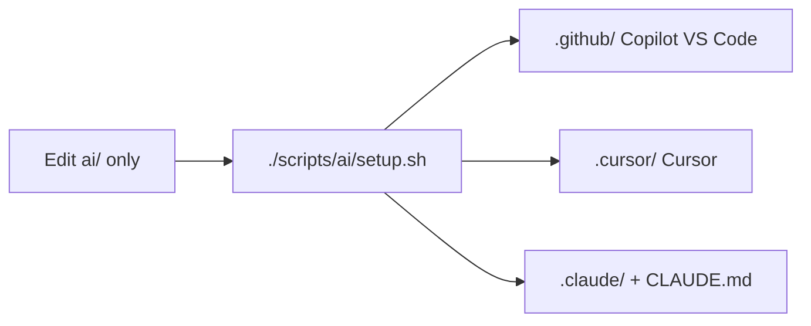

# AI hub — provider-agnostic configuration

| Field | Value |
| ----- | ----- |
| **Date** | 2026-06-03 |
| **Status** | **Planned** (spec only — implementation not started) |
| **Decision** | Option C — neutral `ai/` hub; provider trees are **generated artifacts** (real file copies, never symlinks, not committed) |

---

## 1. Objective

Maintain **one editable source** for agents, skills, prompts, and global instructions (`ai/`), and **materialize provider-specific layouts on demand** when developing with GitHub Copilot, Cursor, or Claude Code.

Goals:

- No duplicate manual edits across `.github/`, `.cursor/`, `.claude/`
- No symlinks (VS Code / Copilot often fail to resolve them for `#file:` and skill discovery)
- Backend and docs reference **`ai/`** paths, not generated adapters
- CI / GitHub Actions under `.github/workflows/` remain normal committed files

This spec is **orthogonal** to runtime `LLMProvider` in Go (Copilot / Claude / OpenCode APIs).

---

## 2. Repository layout

### 2.1 Canonical (committed)

```
ai/                              ← SOURCE OF TRUTH (edit only here)
├── README.md                    ← hub overview + workflow
├── instructions.md              ← global invariants (stack, security, forbidden patterns)
├── agents/
│   ├── task-runner.md
│   └── explore.md
├── skills/
│   └── <skill-name>/
│       ├── SKILL.md
│       └── reference/           ← optional supporting files
└── prompts/
    └── <prompt-name>.md         ← explicit workflows (e.g. pr-remediation)
```

### 2.2 Generated (gitignored — created by compose script)

```
.github/                         ← GitHub Copilot adapter
├── copilot-instructions.md      ← from ai/instructions.md
├── agents/                      ← from ai/agents/ (Copilot naming rules)
├── skills/                      ← from ai/skills/
└── prompts/                     ← from ai/prompts/ (Copilot prompt naming)

.cursor/                         ← Cursor adapter
├── README.md                    ← “do not edit — generated”
├── rules/
│   └── project-invariants.mdc   ← from ai/instructions.md + Cursor rule frontmatter
├── agents/                      ← from ai/agents/ + Cursor-only fields
└── skills/                      ← from ai/skills/ + prompts as skills + Cursor fields

.claude/                         ← Claude Code adapter
└── skills/                      ← from ai/skills/ + ai/prompts/

CLAUDE.md                        ← root pointer + @imports (Claude Code)
```

### 2.3 Unchanged (committed)

```
.github/workflows/
.github/ISSUE_TEMPLATE/
.github/PULL_REQUEST_TEMPLATE/
… any other non-AI .github/ content
```

---

## 3. Compose script (planned)

### 3.1 Deliverables

| Script | Purpose |
| ------ | ------- |
| `scripts/ai/compose.py` | Read `ai/`, write all provider artifacts |
| `scripts/ai/setup.sh` | Thin wrapper: `python3 scripts/ai/compose.py` |
| `scripts/ai/bootstrap-from-github.py` | **One-time migration**: copy existing `.github/` → `ai/` (then stop tracking generated `.github/` AI paths) |

### 3.2 Invocation

```bash
# After clone, or after any edit under ai/
./scripts/ai/setup.sh

# Or directly
python3 scripts/ai/compose.py

# Optional flags (implementation detail)
#   --github-only | --cursor-only | --claude-only
#   --dry-run
```

### 3.3 Compose behavior (high level)

1. Validate `ai/` structure (required files, frontmatter on agents/skills/prompts).
2. **Delete and recreate** each generated target directory (clean generation — no stale files).
3. Emit **real files** (copy + transform). **Never emit symlinks.**
4. Write a short manifest to stdout (counts, paths, warnings).
5. Exit non-zero on validation errors.

Generated files MUST include a header comment where the format allows:

```markdown
<!-- GENERATED FROM ai/ — do not edit. Run: ./scripts/ai/setup.sh -->
```

---

## 4. Portable source schema (`ai/`)

All provider-specific fields are **added at compose time**, not authored in `ai/` (except where noted).

### 4.1 `ai/instructions.md`

- Markdown body: project invariants (today’s `.github/copilot-instructions.md` content, paths updated to `ai/`).
- No YAML frontmatter required.
- Referenced by backend docs and `AGENTS.md`; not tied to a single IDE.

### 4.2 `ai/agents/<name>.md`

Portable frontmatter:

```yaml
---
name: task-runner              # kebab-case
description: >                 # third person; WHAT + WHEN
  ...
readonly: false                # optional; portable semantics
skills:                        # optional; skill names under ai/skills/
  - plan-management
subagents:                     # optional; other agent names
  - explore
---
```

Body: role, constraints, execution model (unchanged semantically from current agents).

**Stripped at source (never stored in `ai/`):** Copilot `tools`, `argument-hint`; Cursor `model`, `is_background`.

### 4.3 `ai/skills/<name>/SKILL.md`

Portable frontmatter:

```yaml
---
name: brainstorming            # matches directory name
description: >                 # third person; WHAT + WHEN
  ...
invocation: auto               # auto | manual
---
```

| `invocation` | Meaning |
| ------------ | ------- |
| `auto` | Superpowers — always-on skills (`brainstorming`, `writing-plans`, `subagent-driven-development`, `test-driven-development`, `caveman`, `rtk`) |
| `manual` | Loaded only when user/agent references the skill |

Body: Purpose, Rules, Checklist (existing skill structure).

### 4.4 `ai/prompts/<name>.md`

Same frontmatter as skills; **`invocation: manual` always**.

Example: `ai/prompts/pr-remediation.md` ← content from today’s `pr-remediation.prompt.md`.

---

## 5. Provider output conventions

The compose script maps `ai/` → each tool’s **documented best practice**.

### 5.1 GitHub Copilot → `.github/`

| Output | Source | Transform |
| ------ | ------ | --------- |
| `.github/copilot-instructions.md` | `ai/instructions.md` | Copy body; prepend generated banner; rewrite internal paths `.github/*` → remain valid in generated tree |
| `.github/agents/<name>.agent.md` | `ai/agents/<name>.md` | **Rename** to `*.agent.md`; add Copilot `tools` allowlist from a small built-in map per agent; restore `argument-hint` if needed |
| `.github/skills/` | `ai/skills/` | Recursive copy of `SKILL.md` + `reference/`; strip portable-only keys; keep `name` + `description` |
| `.github/prompts/<name>.prompt.md` | `ai/prompts/<name>.md` | **Rename** to `*.prompt.md`; copy body |

Copilot does not use Cursor’s `disable-model-invocation` or Claude skill layout.

**Note:** Copilot agent file names may stay `*.agent.md` for picker compatibility; portable source uses flat `<name>.md`.

### 5.2 Cursor → `.cursor/`

| Output | Source | Transform |
| ------ | ------ | --------- |
| `.cursor/rules/project-invariants.mdc` | `ai/instructions.md` | Wrap with `.mdc` frontmatter: `description`, `alwaysApply: true` |
| `.cursor/agents/<name>.md` | `ai/agents/<name>.md` | Add `model: inherit`, `readonly`, `is_background` from portable `readonly` + agent map |
| `.cursor/skills/<name>/SKILL.md` | `ai/skills/` | Add `disable-model-invocation: true` when `invocation: manual` |
| `.cursor/skills/<name>/SKILL.md` | `ai/prompts/<name>.md` | Also emit each prompt as a skill directory for `@name` invocation |

Cursor agents: flat `.md` at `.cursor/agents/` root (no subfolders).

### 5.3 Claude Code → `.claude/` + `CLAUDE.md`

| Output | Source | Transform |
| ------ | ------ | --------- |
| `CLAUDE.md` | `ai/instructions.md` + `AGENTS.md` | Short generated index with `@ai/instructions.md` and `@AGENTS.md` imports |
| `.claude/skills/<name>/SKILL.md` | `ai/skills/` + `ai/prompts/` | Copy skill bodies; Claude-compatible frontmatter (`name`, `description`) |

Claude does not use `.mdc` rules or Copilot `tools` blocks.

---

## 6. Git policy

### 6.1 `.gitignore` entries (AI adapters only)

```gitignore
# ai/ is canonical — committed
# Generated by scripts/ai/compose.py (real files, not symlinks)
.github/copilot-instructions.md
.github/agents/
.github/skills/
.github/prompts/
.cursor/
.claude/
CLAUDE.md
```

### 6.2 What is committed vs ignored

| Path | Git |
| ---- | --- |
| `ai/**` | **Tracked** — sole human-edited AI config |
| `.github/copilot-instructions.md`, `.github/agents/`, `.github/skills/`, `.github/prompts/` | **Ignored** — generated for Copilot / VS Code |
| `.github/workflows/`, templates, etc. | **Tracked** |
| `.cursor/**` | **Ignored** |
| `.claude/**`, `CLAUDE.md` | **Ignored** |

**Do not** add a blanket `.github/` ignore — that would hide CI workflows.

### 6.3 Git history migration (implementation phase)

1. Run `bootstrap-from-github.py` once to populate `ai/` from current `.github/`.
2. Commit `ai/` + updated `.gitignore` + `scripts/ai/*` + this spec.
3. `git rm -r --cached .github/copilot-instructions.md .github/agents .github/skills .github/prompts` (stop tracking duplicates).
4. Each developer runs `./scripts/ai/setup.sh` after pull.

---

## 7. Developer workflow



| When | Action |
| ---- | ------ |
| Start of session (Copilot / Cursor / Claude) | `./scripts/ai/setup.sh` |
| After changing any file under `ai/` | Re-run compose |
| Code review | Reviewers check **only `ai/`** diffs for AI config changes |
| Without compose | Use `#file:ai/skills/<name>/SKILL.md` (canonical paths always work) |

---

## 8. Integration with existing repo docs

| Consumer | Path to use |
| -------- | ----------- |
| `AGENTS.md` registry | List `ai/agents/`, `ai/skills/`, `ai/prompts/`, `ai/instructions.md` |
| `backend` `SKILL_BUNDLE_PATHS` default | `ai/skills/modularity/SKILL.md`, … (not `.github/skills/`) |
| `docs/STARTUP_GUIDE.md` | Document `SKILL_BUNDLE_PATHS` under `ai/skills/` |
| Root `AGENTS.md` | Remains governance index; optional pointer to this spec |

---

## 9. Implementation checklist (future work)

Not in scope for this document edit — track when implementing:

- [ ] Create `ai/` tree (bootstrap from current `.github/`)
- [ ] Implement `scripts/ai/compose.py` per sections 5–6
- [ ] Implement `scripts/ai/setup.sh`
- [ ] Update `.gitignore` per section 6.1
- [ ] Update `AGENTS.md` paths and workflow
- [ ] Update `backend/internal/platform/config/config.go` defaults → `ai/skills/`
- [ ] Add `ai/README.md`
- [ ] Remove tracked `.github/` AI duplicates from git index
- [ ] Verify VS Code `#file:.github/skills/...` after compose (real files)
- [ ] Verify Cursor `@skill` and always-on rule after compose
- [ ] Document compose in `docs/STARTUP_GUIDE.md`

---

## 10. Non-goals

- Replacing root `AGENTS.md` with `ai/instructions.md` (different purposes: governance vs invariants)
- Committing generated adapter trees
- Symlinks as adapter mechanism
- Auto-running compose on every git commit (optional pre-commit hook may be added later)

---

## 11. References

- [AGENTS.md](../../AGENTS.md) — agent/skill governance (to align at implementation)
- Cursor: project rules (`.mdc`), subagents (`.cursor/agents/*.md`), skills (`.cursor/skills/`)
- GitHub Copilot: `.github/copilot-instructions.md`, custom agents, prompt files
- Claude Code: `CLAUDE.md`, `.claude/skills/`
- [agents.md](https://agents.md/) — cross-tool `AGENTS.md` convention (complementary, not a replacement for `ai/`)
